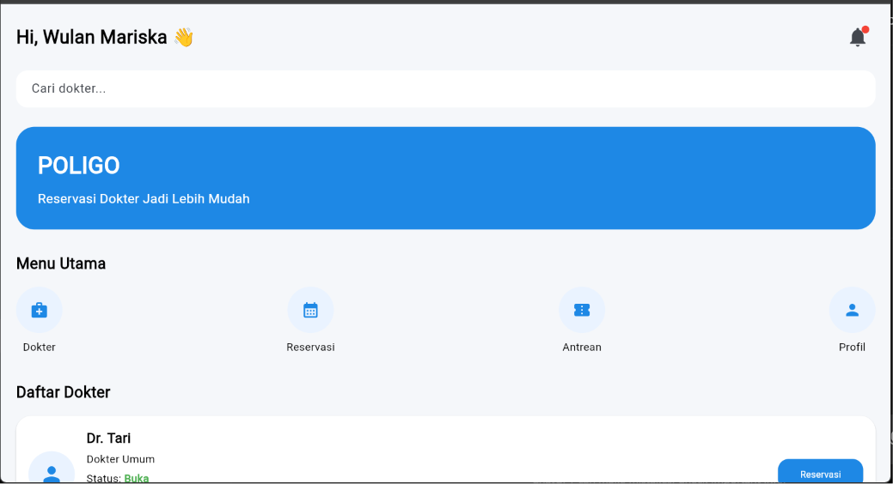
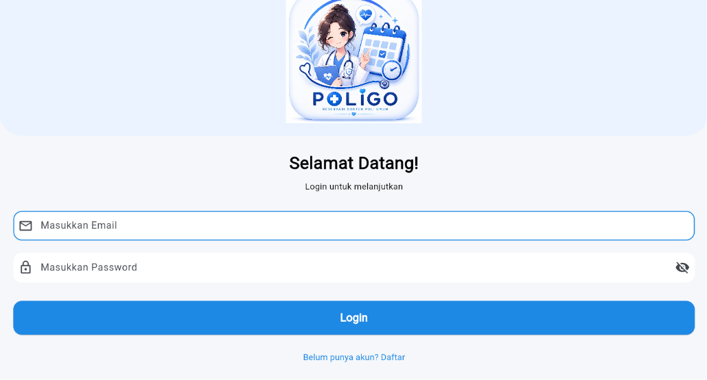
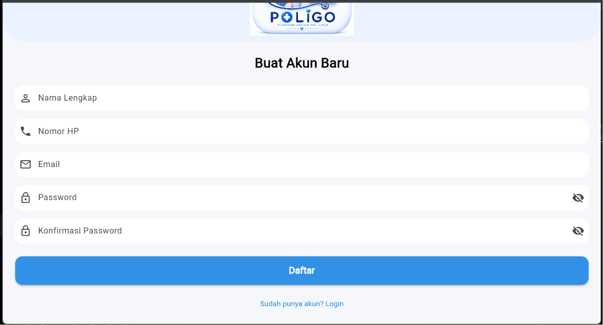
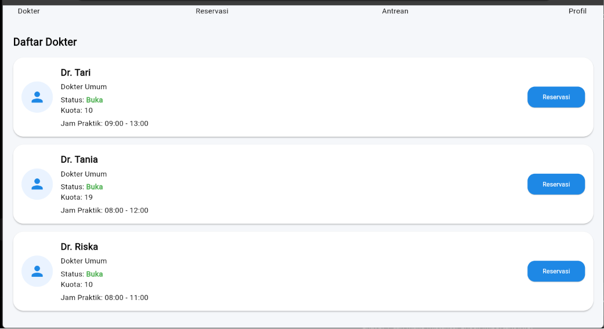
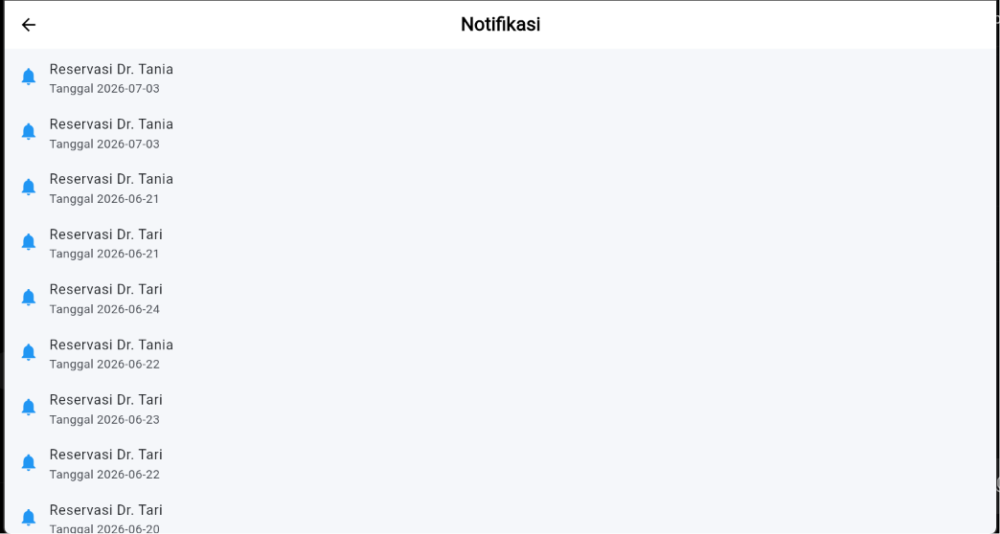
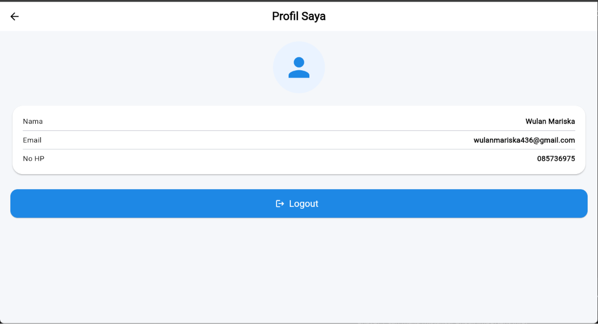

# poligo2

A new Flutter project.

## Getting Started

This project is a starting point for a Flutter application.

A few resources to get you started if this is your first Flutter project:

- [Learn Flutter](https://docs.flutter.dev/get-started/learn-flutter)
- [Write your first Flutter app](https://docs.flutter.dev/get-started/codelab)
- [Flutter learning resources](https://docs.flutter.dev/reference/learning-resources)

For help getting started with Flutter development, view the
[online documentation](https://docs.flutter.dev/), which offers tutorials,
samples, guidance on mobile development, and a full API reference.


# 🩺 POLIGO
### Sistem Reservasi dan Antrean Poli Umum Berbasis Mobile

<p align="center">
  
</p>

---

## 📖 Tentang Aplikasi

POLIGO merupakan aplikasi mobile berbasis Flutter yang dirancang untuk membantu proses reservasi dokter secara online sehingga pasien tidak perlu datang langsung ke klinik hanya untuk mengambil nomor antrean.

Melalui aplikasi ini, pasien dapat melihat daftar dokter, melakukan reservasi, memperoleh nomor antrean otomatis, memantau status antrean, serta menerima pengingat jadwal konsultasi.

---

# ✨ Fitur Aplikasi

- ✅ Login
- ✅ Register
- ✅ Home
- ✅ Search Dokter
- ✅ Daftar Dokter
- ✅ Reservasi Dokter
- ✅ Nomor Antrean Otomatis
- ✅ Status Antrean
- ✅ Estimasi Waktu
- ✅ Batalkan Reservasi
- ✅ Reminder Jadwal
- ✅ Notifikasi
- ✅ Profil Pengguna

---

# 📱 Tampilan Aplikasi

## Login

<p align="center">

</p>

---

## Register

<p align="center">

</p>

---

## Home

<p align="center">


</p>

---

## Halaman Dokter

<p align="center">

</p>

---

## Halaman Reservasi

<p align="center">

</p>

---

## Halaman Antrean

<p align="center">

</p>

---

## Notifikasi

<p align="center">

</p>

---

## Profil

<p align="center">

</p>

---

# 🛠️ Teknologi

- Flutter
- Dart
- Supabase
- PostgreSQL
- Git
- GitHub

---

# 📂 Struktur Project

```
lib
│
├── models
├── screens
│   ├── login
│   ├── register
│   ├── home
│   ├── dokter
│   ├── reservasi
│   ├── antrian
│   ├── profile
│   └── notifikasi
│
├── services
├── widgets
└── main.dart
```

---

# 👥 Tim Pengembang

| Nama | Peran |
|------|--------|
| Ni Ketut Antari 
| Ni Komang Tania Puspita Sari 
| Ni Kadek Wulan Mariska Dewi 

---


# 📌 Mata Kuliah

Mobile Programming

Institut Bisnis dan Teknologi Indonesia (INSTIKI)

Tahun Ajaran 2026/2027

---

# ❤️ Terima Kasih

Terima kasih telah mengunjungi repository POLIGO.